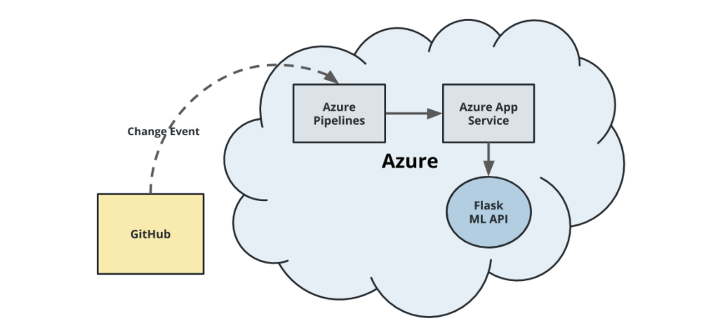
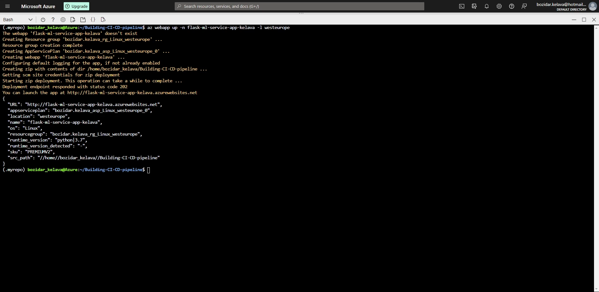
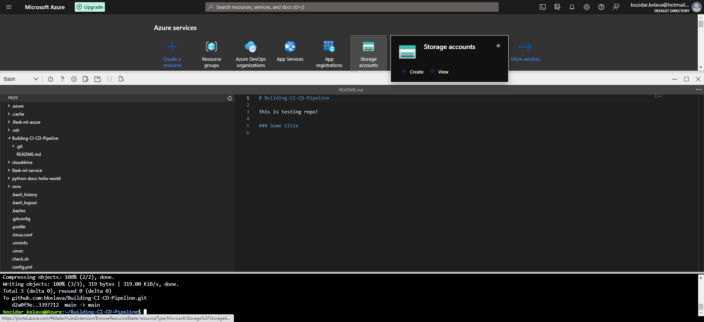
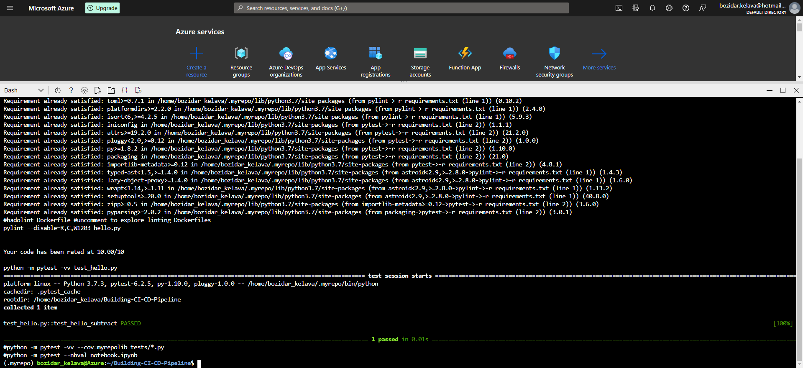
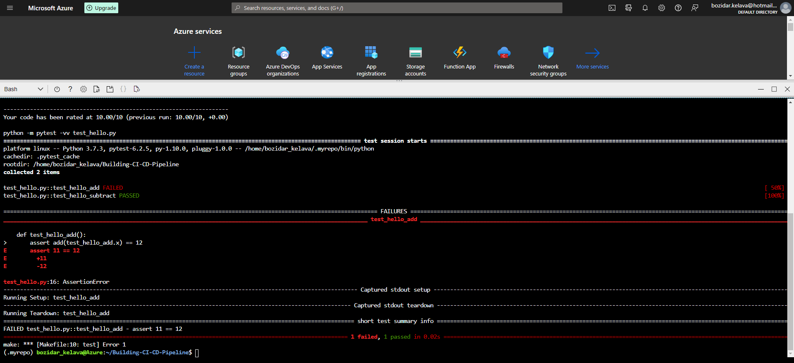
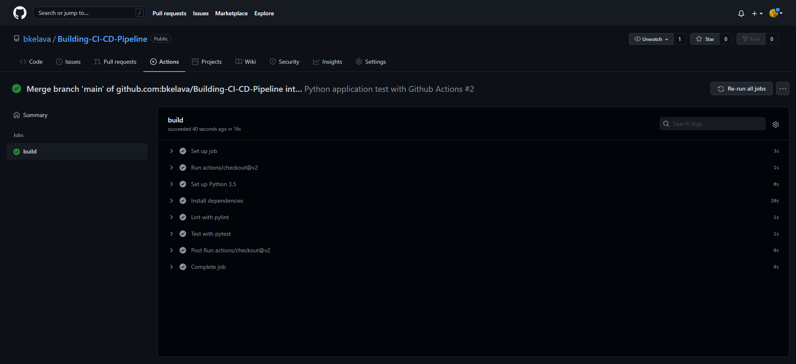
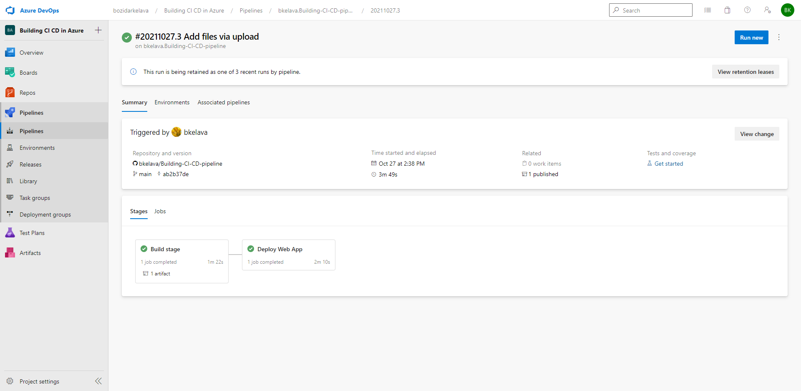
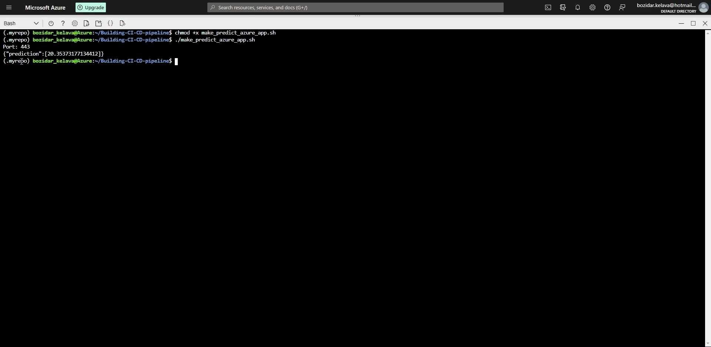

# Overview

This is a learning project for Continuous Integration and Continuous Delivery using Azure, Github Actions and some additional tools.

## Project Plan

#### Trello Board
https://trello.com/b/rdUhdeFN

#### Spreadsheet Project plan
https://docs.google.com/spreadsheets/d/1fNluo_JC4HPWBknRxiDxSQpSzh9pzC0QY8Lm7JftJpQ/edit#gid=1348135932

## Instructions

#### Architectural Diagram

1. Create Github repository

2. Launch an Azure Cloud Shell environment and create ssh-keys, upload those keys to your GitHub account, reffer to documentation: https://docs.github.com/en/authentication/connecting-to-github-with-ssh/adding-a-new-ssh-key-to-your-github-account

* Project running on Azure App Service

* Project cloned into Azure Cloud Shell

* Passing tests that are displayed after running the `make all` command from the `Makefile`

* Example of failing test

* Output of a test run

* Successful deploy of the project in Azure Pipelines.  .

* Running Azure App Service from Azure Pipelines automatic deployment

* Successful prediction from deployed flask app in Azure Cloud Shell.  [Use this file as a template for the deployed prediction](https://github.com/udacity/nd082-Azure-Cloud-DevOps-Starter-Code/blob/master/C2-AgileDevelopmentwithAzure/project/starter_files/flask-sklearn/make_predict_azure_app.sh).

* Output of streamed log files from deployed application

> 

## Enhancements

<TODO: A short description of how to improve the project in the future>

## Demo 

<TODO: Add link Screencast on YouTube>

