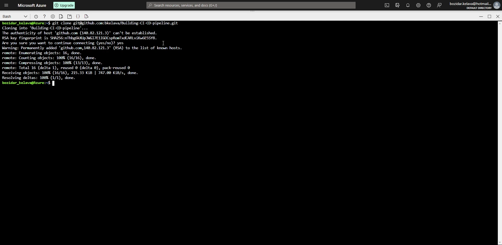
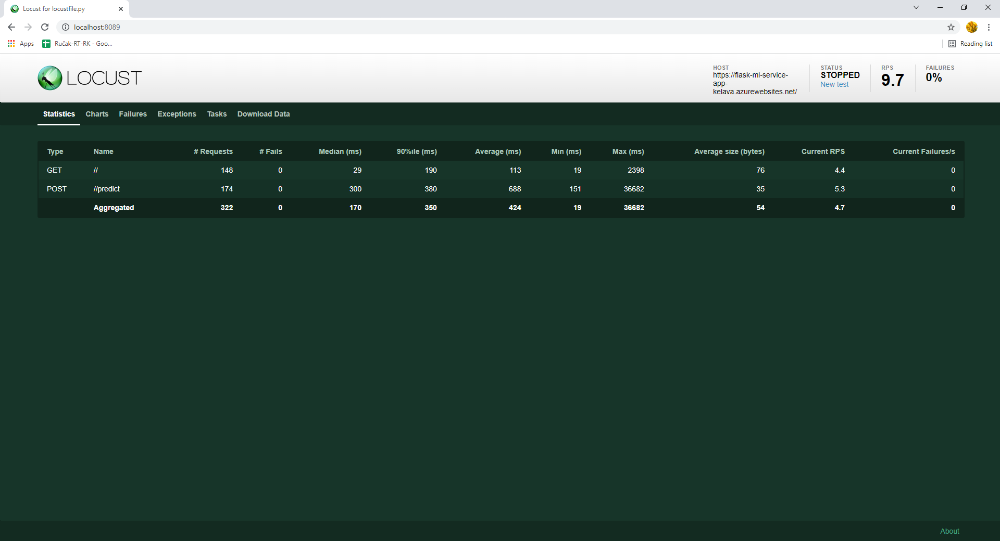
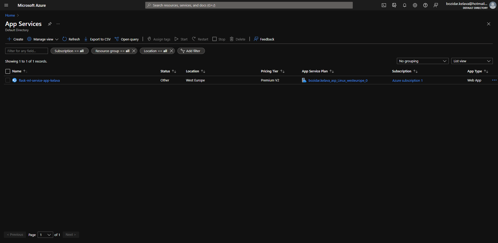
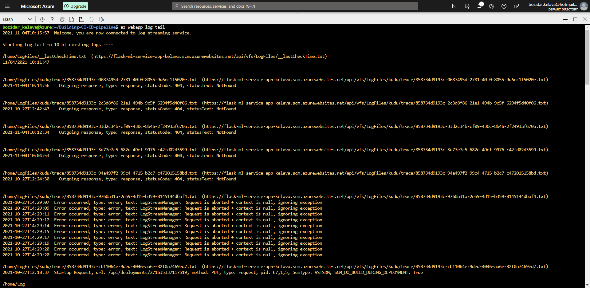
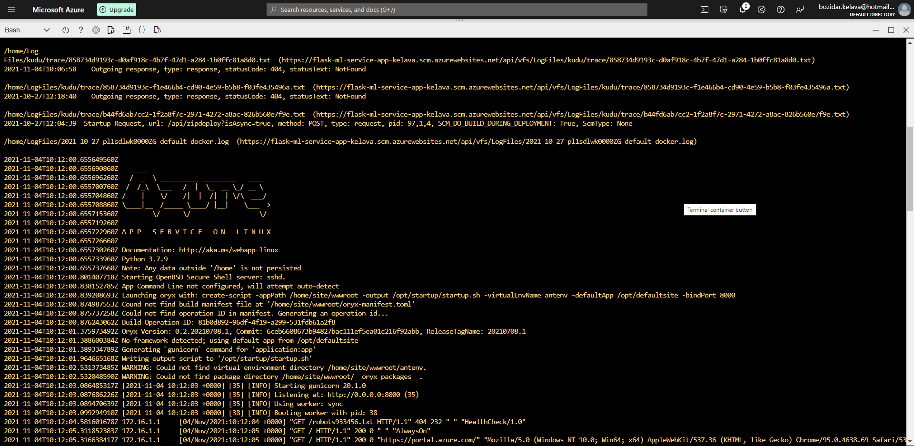
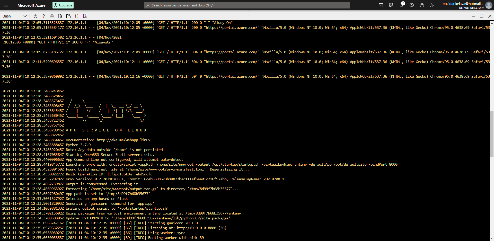
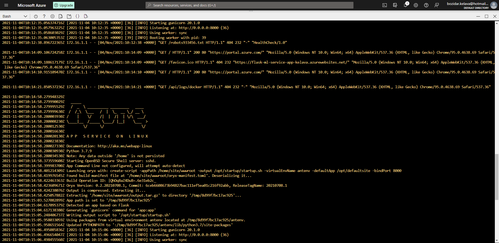
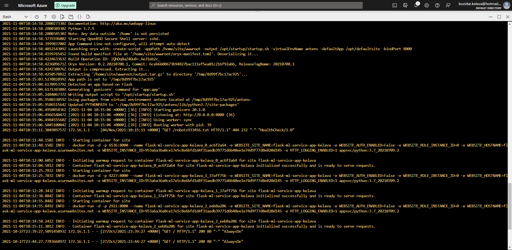
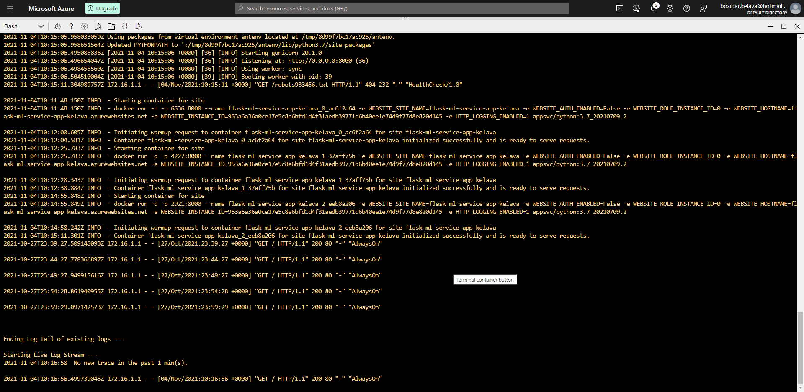

# Overview

Infrastructure as code provides a significant advantage in terms of defining, deploying, upgrading, and destroying infrastructure. So, in order to produce a virtual machine image that contains our application for repeatable deployments, we'll utilize packer (in JSON format). Terraform extends this by deploying storage, networking, and security entities across numerous infrastructures, clouds, and vendors, in addition to virtual machines. This project will deploy a flexible, scalable web server in Azure using a Packer template and a Terraform template based on them.

## Project Plan

#### Trello Board
https://trello.com/b/rdUhdeFN

#### Spreadsheet Project plan
https://docs.google.com/spreadsheets/d/1fNluo_JC4HPWBknRxiDxSQpSzh9pzC0QY8Lm7JftJpQ/edit?usp=sharing

## Instructions

#### Architectural Diagram

1. Launch an Azure Cloud Shell environment and create ssh-keys, upload those keys to your GitHub account, reffer to documentation: https://docs.github.com/en/authentication/connecting-to-github-with-ssh/adding-a-new-ssh-key-to-your-github-account
2. Create project scaffolding, files are provided in this repository.
3. Make local test
4. Clone project to Cloud Shell
5. Configure GitHub Actions
6. Create continous delivery in Azure- make a prediction test with Locust
7. Enable continous deployment iz Azure Pipelines
8. Enable GitHub actions to worth with Azure Piplens
9. Make a final test and stream logs

:information_source: Instructions are provided in video below

### Screenshots

* Project running on Azure App Service

* Project cloned into Azure Cloud Shell

* Passing tests that are displayed after running the `make all` command from the `Makefile`

* Example of failing test

* Locust run

* Output of a test run

* Successful deploy of the project in Azure Pipelines. (https://docs.microsoft.com/en-us/azure/devops/pipelines/ecosystems/python-webapp?view=azure-devops).

* Running Azure App Service from Azure Pipelines automatic deployment

* Successful prediction from deployed flask app in Azure Cloud Shell. (https://github.com/udacity/nd082-Azure-Cloud-DevOps-Starter-Code/blob/master/C2-AgileDevelopmentwithAzure/project/starter_files/flask-sklearn/make_predict_azure_app.sh).

* App-services in Microsoft Azure

* Output of streamed log files from deployed application

## Enhancements

* Using GitHub actions to deploy the web applications can improve this project. 
* For continuous delivery, we can use GitHub Actions and Azure Pipelines. 
* We can also change the pipeline such that it only fires when there is a Pull Request.

## Demo

https://www.youtube.com/watch?v=0CzSdVLHLNY
